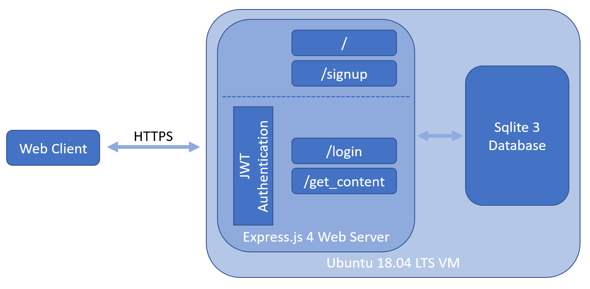

<<<<<<< HEAD

=======
# Intent Labeller
>>>>>>> de5aa60bdb13d3b769c6577a94fc3e6842b735fc

This is a data labelling web-application built to enable anonymous data labelling to support my Master's research.
Specifically, the site enabled participants to label short sections of text as containing or not-containing intent.
Additional information regarding the purpose of the site and ethics approval can be seen in the [information components](./src/components/information.jsx).
The application was deployed from March to May 2020, during which time it collected labels for ~500 contexts.

An overview of the application's implementation can be seen in the figure below.
The front-end is built in [React](https://github.com/facebook/react) with an [Express 4](https://github.com/expressjs/expressjs.com) backend.
All requests are forced through an HTTPS connection with an auto-renewing certificate through [greenlock](https://www.npmjs.com/package/greenlock-express).
*Login* and *content* requests are additionally authenticated by a previously issued JWT, tying the request to a user.
This ensures all users agree to participate first and unrelated parties from being able to submit labels for data.
The data layer is implemented using a node wrapper around [SQLite3](https://www.sqlite.org/index.html).
For more information about the projects dependencies look at the [package file](./package.json).

## Setup

To setup the site:

* Clone the repo
* Install npm
* Install dependencies, build the site, build database, and generate keys by running `setup.sh`

## Usage

Start the server by running `run.sh` after completing the setup process.
